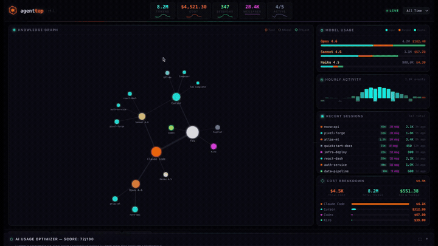
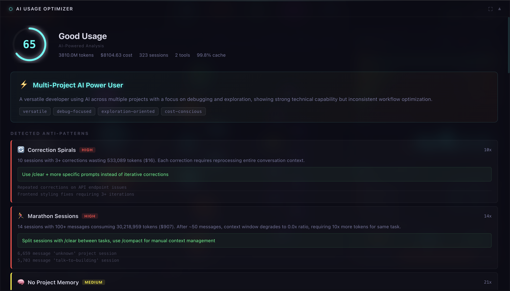
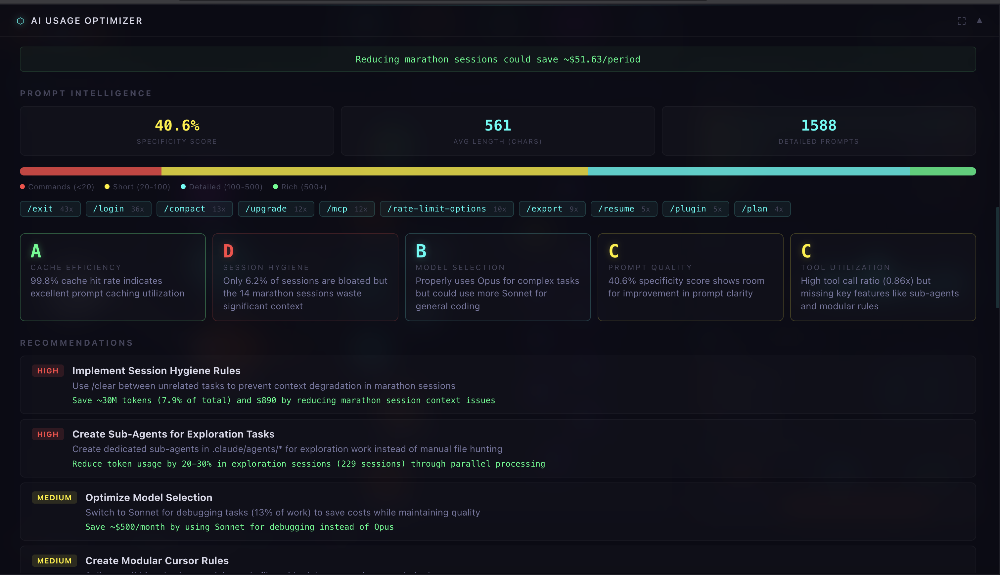
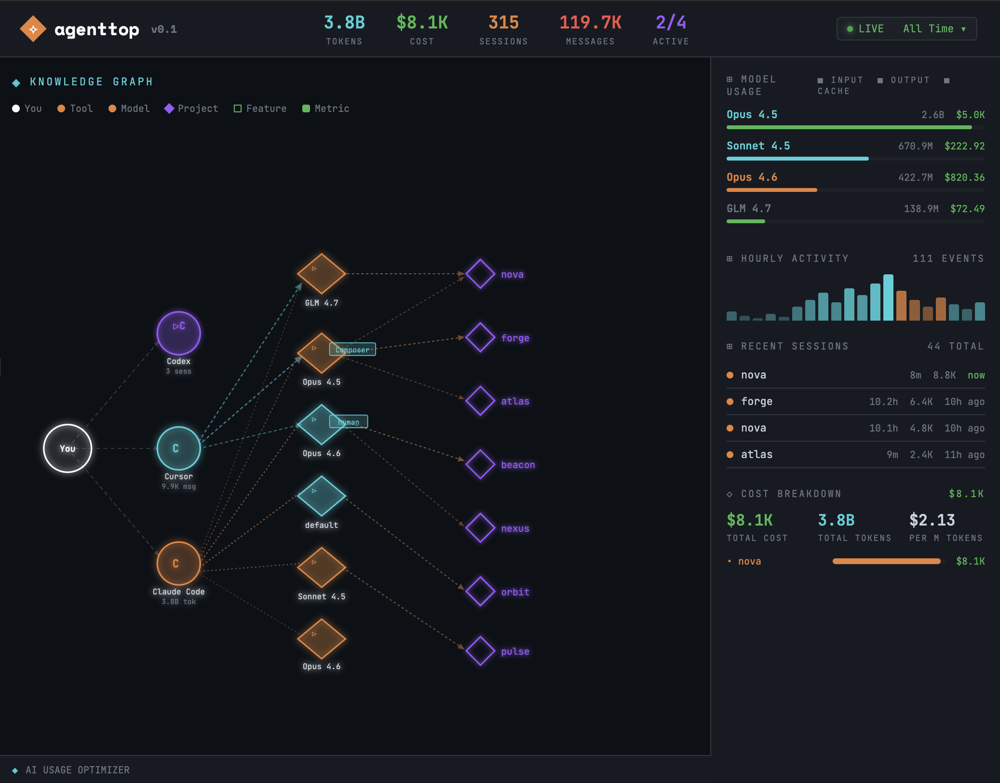

# agenttop

`htop` for AI coding agents. See where your tokens go.

```bash
git clone https://github.com/vicarious11/agenttop && cd agenttop
./setup.sh
./run.sh        # http://localhost:8420
```

That's it. `setup.sh` handles Python, virtualenv, dependencies, and Ollama. Nothing installed globally.

Or if you prefer pip:

```bash
pip install agenttop
agenttop web
```

That's it. Two commands. Works immediately — auto-installs a local LLM, pulls the model, opens the dashboard. No API keys, no config, no signup.

<div align="center">



**[Watch full demo (45s)](assets/screenshots/demo.mp4)**

</div>



## What it does

You're mass-spending on AI coding tools and you have no idea where the money goes. agenttop reads your local usage data from **Claude Code, Cursor, Kiro, Codex, and Copilot** and shows you everything: tokens, costs, sessions, models, projects, hourly patterns — across all your tools in one place.

Then an LLM analyzes your actual workflow and tells you what you're doing wrong.

## The optimizer

This is not a dashboard that shows you a number and leaves. The optimizer builds a profile from your real data, runs it through an LLM, and comes back with specific, actionable analysis.

**Anti-patterns** — correction spirals where you keep re-prompting instead of starting fresh. Marathon sessions past 50 messages where the AI forgets your original intent. Repeated prompts that could be a CLAUDE.md rule instead.

**Cost forensics** — not "you spent $X" but _which project is burning money, which model is overkill for what you're doing, and how much you'd save by switching_. Broken down by project, by model, with waste estimates.

**Missing features** — CLAUDE.md project memory, custom slash commands, prompt caching, sub-agents, multi-file editing. You're paying for tools with capabilities you've never touched. The optimizer cross-references your usage against a knowledge base of official docs and tells you which features would actually help _you_, based on your patterns.

**Developer profile** — maps your style (debug warrior, explorer, methodical builder) and gives targeted advice instead of generic tips.

**Grades** — cache efficiency, session hygiene, model selection, prompt quality, tool utilization. Letter grades with explanations referencing your actual numbers.



## Knowledge graph

Every tool, model, project, and feature — connected in a force-directed graph. See which model eats which project's budget at a glance.



## How it works

```
~/.claude/  ~/.cursor/  ~/...Kiro/  ~/.codex/  ~/.config/github-copilot/
     │           │          │          │              │
     └───────────┴──────────┴──────────┴──────────────┘
                            │
                       Collectors
                       (read-only)
                            │
                     Event / Session
                            │
                  ┌─────────┴─────────┐
                  │                   │
            Web Dashboard         TUI Dashboard
            (D3 + FastAPI)        (Textual)
                  │
              Optimizer
         (Python metrics + LLM)
```

Collectors read local data directories. No network calls, no telemetry, no cloud uploads. Your data never leaves your machine. The optimizer is the only component that calls an LLM — local Ollama by default.

The optimizer itself is a hybrid:

- **Python computes deterministic metrics** — anti-patterns, cost forensics, prompt analysis, context engineering. These are always accurate regardless of LLM quality.
- **LLM adds intelligence** — grades, recommendations, developer profile, project insights. Structured JSON in, structured JSON out.
- **Graceful degradation** — if the LLM is unavailable, the dashboard still shows all Python-computed metrics.

## Setup

`agenttop web` handles everything automatically on first run:

1. Installs Ollama if missing (brew on macOS, install script on Linux)
2. Starts the Ollama server
3. Pulls `gemma3:4b` (~3GB, one-time download)
4. Opens the dashboard at `localhost:8420`

Zero configuration required. Everything runs locally.

### Cloud providers

If you'd rather use a cloud LLM:

```bash
# Anthropic
export ANTHROPIC_API_KEY=sk-ant-...
agenttop web --provider anthropic --model claude-haiku-4-5-20251001

# OpenAI
export OPENAI_API_KEY=sk-...
agenttop web --provider openai --model gpt-4o-mini

# OpenRouter
export OPENROUTER_API_KEY=sk-or-...
agenttop web --provider openrouter --model openrouter/google/gemini-2.0-flash-001
```

Or edit `~/.agenttop/config.toml` (created by `agenttop init`).

## Supported tools

| Tool        | Data source                           | What's tracked                                        |
| ----------- | ------------------------------------- | ----------------------------------------------------- |
| Claude Code | `~/.claude/`                          | Sessions, tokens, tool calls, costs, models, projects |
| Cursor      | `~/.cursor/ai-tracking/`              | AI code gen, conversations, AI vs human ratio         |
| Kiro        | `~/Library/Application Support/Kiro/` | Agent activity                                        |
| Codex       | `~/.codex/`                           | Sessions, token usage                                 |
| Copilot     | `~/.config/github-copilot/`           | Completions, suggestions                              |
| Any tool    | Local proxy                           | Token counts, latency, costs                          |

## Commands

```
agenttop              # TUI dashboard
agenttop web          # web dashboard with optimizer (localhost:8420)
agenttop stats        # quick CLI summary
agenttop analyze      # workflow analysis (CLI)
agenttop init         # generate ~/.agenttop/config.toml
agenttop proxy        # API proxy for unsupported tools
```

`--days 7` for time range. `--provider` / `--model` to override LLM. `--port` to change port.

## Proxy

For tools that don't store data locally, run the transparent proxy:

```bash
agenttop proxy
export ANTHROPIC_BASE_URL=http://localhost:9120/anthropic
export OPENAI_BASE_URL=http://localhost:9120/openai
```

All API calls flow through agenttop and get logged. The proxy forwards requests unchanged.

## Development

```bash
git clone https://github.com/vicarious11/agenttop
cd agenttop
./setup.sh --no-ollama
source .venv/bin/activate
pytest
```

## License

Apache 2.0
