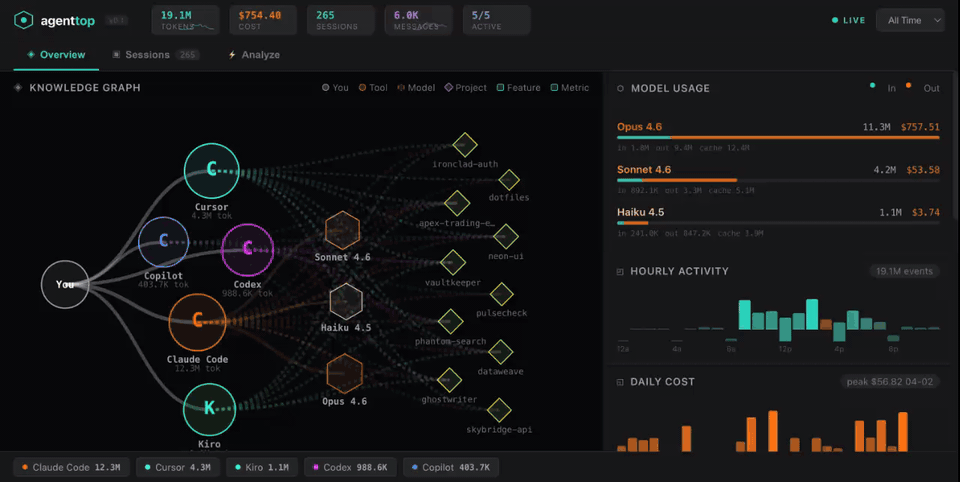

<p align="center">
  
</p>

<h1 align="center">agenttop</h1>

<p align="center">
  <b>htop for AI coding agents.</b><br>
  <sub>See exactly where your Claude, Cursor, Kiro, Copilot, and Codex tokens are going — and what it's costing you.</sub>
</p>

<p align="center">
  <a href="#install">Install</a> ·
  <a href="#what-you-get">What you get</a> ·
  <a href="#vs-other-tools">vs other tools</a> ·
  <a href="#how-it-works">How it works</a> ·
  <a href="#ai-analysis">AI Analysis</a> ·
  <a href="#roadmap">Roadmap</a>
</p>

<p align="center">
  
  
  
  
  
</p>

---

<p align="center">
  
</p>

---

## Why this exists

I was using Claude Code, Cursor, and Kiro every day. Each of them stores usage data locally — JSONL logs, SQLite databases, workspace state — but **none of them show you the full picture**. I had no idea:

- Which project was burning most of my tokens
- Which model I was over-using
- Whether my prompts were causing correction spirals (they were)
- How much of my Cursor tab output was actually accepted

So I built agenttop. One view across every tool. Real numbers computed from actual tool-call data, not keyword guessing. Optional AI analysis that tells you *specifically what to change*. All local. Nothing leaves your machine.

---

## Install

**One line.** Installs everything, asks what to launch (web / TUI, real data / demo).

```bash
curl -fsSL https://raw.githubusercontent.com/vicarious11/agenttop/main/install.sh | bash
```

Skip the menu and jump straight into a mode:

```bash
curl -fsSL https://raw.githubusercontent.com/vicarious11/agenttop/main/install.sh | bash -s -- web-demo
# modes: web | web-demo | tui | tui-demo | none
```

After install:

```bash
agenttop               # terminal dashboard — your real data
agenttop --demo        # terminal — demo data (safe for recordings)
agenttop web           # web dashboard at localhost:8420
agenttop web --demo    # web — demo data
```

Requirements: Python 3.10+, git. No Docker. No API keys needed. macOS, Linux, Windows (WSL).

Keyboard (TUI): `d` dashboard · `s` sessions · `e` explorer · `a` analysis · `k` graph · `1-4` time range · `q` quit

---

## What you get

### Terminal dashboard

7 panels, updates live:

- **Cost by project** — which repo is burning your money
- **Cost by model** — opus vs sonnet vs haiku split
- **Daily cost** — 30-day histogram with total / avg / peak
- **Hourly activity** — when you actually work
- **Activity breakdown** — coding / debugging / testing / exploration %
- **Tools** — per-tool sessions, tokens, cost
- **One-shot rate** — % of edits that pass without retry

### Web dashboard

Three tabs:

- **Overview** — force-directed knowledge graph (D3), model usage (input/output/cache), hourly activity, daily cost, cost breakdown, activity classification, cost by project
- **Sessions** — full-page browser with Google-style pagination. Search by project or prompt. Sort by Recent / Top Cost / Least Cost / Most Tokens / Longest. Tool chips (Edit 5, Bash 3, Read 12) and model chips on every session. Click for full prompt history
- **Analyze** — select sessions, run LLM analysis. **Scoped to selected sessions only** — cost, tokens, cache rate, model breakdown all computed from exactly what you selected. Deep-dive report with score, grades, cost forensics, anti-patterns, recommendations

URL hash routing (`#sessions`, `#analyze`) for deep links.

---

## vs other tools

| | agenttop | [ccusage](https://github.com/ryoppippi/ccusage) | cursor-stats | Anthropic Console |
|---|---|---|---|---|
| Claude Code | ✅ full | ✅ | ❌ | ✅ web only |
| Cursor | ✅ | ❌ | ✅ | ❌ |
| Kiro | ✅ | ❌ | ❌ | ❌ |
| Copilot | ✅ | ❌ | ❌ | ❌ |
| Codex | ✅ | ❌ | ❌ | ❌ |
| Per-tool-call breakdown | ✅ (Edit/Bash/Read counts) | ✅ | ❌ | ❌ |
| Cross-tool unified view | ✅ | — | — | ❌ |
| Session-scoped cost analysis | ✅ | ❌ | ❌ | ❌ |
| AI-powered recommendations | ✅ (local LLM option) | ❌ | ❌ | ❌ |
| Terminal UI + Web UI | ✅ | CLI only | ❌ | Web only |
| Zero telemetry | ✅ | ✅ | ✅ | ❌ |
| One-line install | ✅ | npm | — | — |

If you only use Claude Code, `ccusage` is lighter-weight. If you use 2+ AI coding tools, agenttop is the only thing that shows you a unified picture.

---

## Features in detail

### Data extraction (all read-only)

| Tool | Source | What agenttop extracts |
|------|--------|------------------------|
| **Claude Code** | `~/.claude/projects/**/*.jsonl` | Exact per-message token counts (input, output, cache read, cache create). Model per message. **Every tool call name** (Edit, Bash, Read, Grep, Agent, Write — from `tool_use` content blocks). Up to 50 user prompts per session. Project path from `cwd`. Cost from per-model pricing. |
| **Cursor** | `~/.cursor/ai-tracking/ai-code-tracking.db` | Conversations from SQLite. Source type (tab/composer/chat). AI vs human code ratio from `scored_commits`. Model per code hash. Project resolution via `ide_state.json` workspace mapping. |
| **Kiro** | `~/Library/.../Kiro/User/globalStorage/state.vscdb` | Session data from VS Code state DB. Keys matching `kiro%`, `chat%`, `session%`. Message counts and timestamps. |
| **Codex** | `~/.codex/` | Prompt history from `.codex-global-state.json`. Session rollouts from `sessions/`. Automation data from SQLite. Config (model, reasoning effort). |
| **Copilot** | `~/.config/github-copilot/session-state/` | Per-session JSON with message content. Model extraction. Custom agent detection. Token estimation from content length. |

agenttop never writes to your tool data.

### Activity classification

Deterministic. No LLM. Classified from **actual tool-call data** (Claude Code), falls back to prompt keywords for tools that don't expose tool calls.

| Activity | How it's detected |
|----------|-------------------|
| **coding** | Edit, Write, MultiEdit tool calls |
| **debugging** | Bug/error/fix keywords + Edit/Bash patterns |
| **testing** | Bash calls with pytest/jest/vitest/cargo test |
| **exploration** | Read, Grep, Glob calls without edits |
| **refactoring** | Refactor/rename/extract keywords + Edit patterns |
| **git ops** | Bash calls with git commands |
| **planning** | EnterPlanMode, TaskCreate, Agent tool calls |
| **other** | Everything else |

### One-shot success rate

Percentage of edit turns that pass without retry. Detects `Edit → correction prompt → Edit` retry cycles. **Higher = better prompting, fewer wasted tokens.**

When `tool_breakdown` is available (Claude Code), uses actual Edit/Write call counts. Falls back to prompt analysis for other tools.

### Cost analysis

- **Cost by project** — which repo burns the most, with session count
- **Cost by model** — opus / sonnet / haiku split computed from actual per-model pricing (input / output / cache rates)
- **Daily cost histogram** — 30-day trend with total / average / peak day
- **Cache hit rate** — from actual `cacheReadInputTokens` vs `inputTokens` in Claude Code data

### Session data model

```python
Session(
    tool_breakdown={"Edit": 5, "Bash": 3, "Read": 12, "Grep": 4},
    models_used={
        "claude-opus-4-6": {
            "inputTokens": 4200, "outputTokens": 38000,
            "cacheReadInputTokens": 12000,
            "cacheCreationInputTokens": 800, "count": 8,
        },
    },
    prompts=["fix the race condition in...", ...],
    total_tokens=48291,
    estimated_cost_usd=12.47,
    message_count=23,
    tool_call_count=24,
    # + id, tool, project, start_time, end_time
)
```

`models_used` stores exact per-model token breakdown. When you analyze 3 sessions, costs are computed from those 3 sessions' real tokens, not global averages.

---

## AI Analysis

Optional. Select sessions, run LLM analysis, get a report.

**Three-phase pipeline (Map-Reduce-Generate):**

1. **MAP** — batches selected sessions into LLM calls with full prompt history. Classifies each: intent, correction spirals, prompt quality, wasted effort. Results cached per session ID — sessions are immutable, never re-analyzed.

2. **REDUCE** — pure Python, no LLM. Deterministic score from 5 dimensions (0–20 points each):

   | Dimension | Source | Formula |
   |-----------|--------|---------|
   | Session hygiene | MAP classifications | `spiral_free_sessions / total × 20` |
   | Prompt quality | MAP classifications | `no_waste_sessions / total × 20` |
   | Cost efficiency | Python cost forensics | `(1 - waste_pct / 100) × 20` |
   | Cache efficiency | Claude `model_usage` | `cache_hit_rate / 100 × 20` |
   | Tool utilization | Feature detection | `features_used / available × 20` |

3. **GENERATE** — single LLM call with ~2K tokens of pre-computed metrics. LLM writes prose (developer profile, recommendations, project insights). **Does NOT compute any numbers** — those come from REDUCE.

Score is fully traceable. *"Session hygiene: 14/20 — 23/30 sessions had no correction spirals."*

**LLM providers:** Ollama (free, local — nothing leaves your machine), Anthropic, OpenAI, OpenRouter.

```bash
agenttop init  # interactive setup wizard
```

---

## Demo mode

Safe for recordings and screenshots. Generates realistic fake data — 10 projects, 265 sessions across 5 tools, with handwritten prompts that read like real engineering work.

```bash
agenttop --demo        # terminal with fake data
agenttop web --demo    # web dashboard with fake data
```

Deterministic. Same screenshots every time.

---

## How it works

```
~/.claude/  ~/.cursor/  ~/.codex/  ~/.config/github-copilot/  ~/Library/.../Kiro/
     |           |          |              |                        |
     v           v          v              v                        v
  COLLECTORS — parse tool-specific local files
  │  Claude:  JSONL → exact tokens, tool names, model per message
  │  Cursor:  SQLite → conversations, AI vs human ratio, models
  │  Codex:   JSON + SQLite → prompts, automations, rollouts
  │  Copilot: JSON → session messages, model, agents
  │  Kiro:    SQLite → VS Code state keys
  │
  └──> unified Session model (tool_breakdown, models_used, prompts, tokens, cost)
          │
          ├──> WEB DASHBOARD (FastAPI + D3 + vanilla JS, port 8420)
          │    overview (knowledge graph) | sessions (paginated) | analyze
          │
          ├──> TERMINAL DASHBOARD (Textual + Rich)
          │    dashboard | sessions | explorer | analysis | graph
          │
          └──> OPTIMIZER (Map-Reduce-Generate, optional)
               MAP: batch LLM call, cached per session
               REDUCE: deterministic score 0-100
               GENERATE: prose recommendations
```

---

## Privacy

- **Zero telemetry.** No data collection. No cloud uploads. No analytics.
- **Read-only.** Never writes to your AI tool directories.
- **With Ollama:** nothing leaves your machine at all — LLM analysis runs locally.
- **With cloud LLMs:** only the sessions you explicitly select for analysis are sent (to the provider you configured), never full history.

---

## Configuration

Zero config by default. For AI analysis:

```bash
agenttop init
```

or manually:

```toml
# ~/.agenttop/config.toml
[llm]
provider = "ollama"           # ollama | anthropic | openai | openrouter
model = "ollama/gemma3:4b"    # any litellm-compatible model
```

Environment variable overrides: `AGENTTOP_LLM_PROVIDER`, `AGENTTOP_LLM_MODEL`, `ANTHROPIC_API_KEY`.

---

## Roadmap

- [ ] **PyPI release** — `pipx install agenttop` coming soon
- [ ] **Windsurf, Aider, Continue** collectors
- [ ] **Team view** — opt-in aggregation across machines (still local-first, via synced directory)
- [ ] **Budget alerts** — terminal and desktop notifications when crossing daily/weekly thresholds
- [ ] **Shareable reports** — export an analysis as a redacted HTML/PDF for sharing
- [ ] **IDE extension** — inline cost badges per file in VS Code

Star the repo to follow — star count is how I decide what to build next.

---

## Contributing

- **Add a collector for a new tool:** subclass `BaseCollector` in `src/agenttop/collectors/`, register it in `src/agenttop/web/server.py` and `src/agenttop/tui/app.py`. See `claude.py` for the reference implementation.
- **Add an optimizer dimension:** extend `_compute_deterministic_score()` in `src/agenttop/web/optimizer/optimizer.py`.
- **Bug reports / feature requests:** open an issue with tool + version + a redacted snippet of the relevant data file.
- **PRs welcome.** Run `pytest` before submitting.

---

## License

Apache 2.0.

## Built with

[@AbhilashSri](https://github.com/AbhilashSri) (workflow intelligence, code reviews), [@Mohit](), [@Akshit]() (testing, UX).
