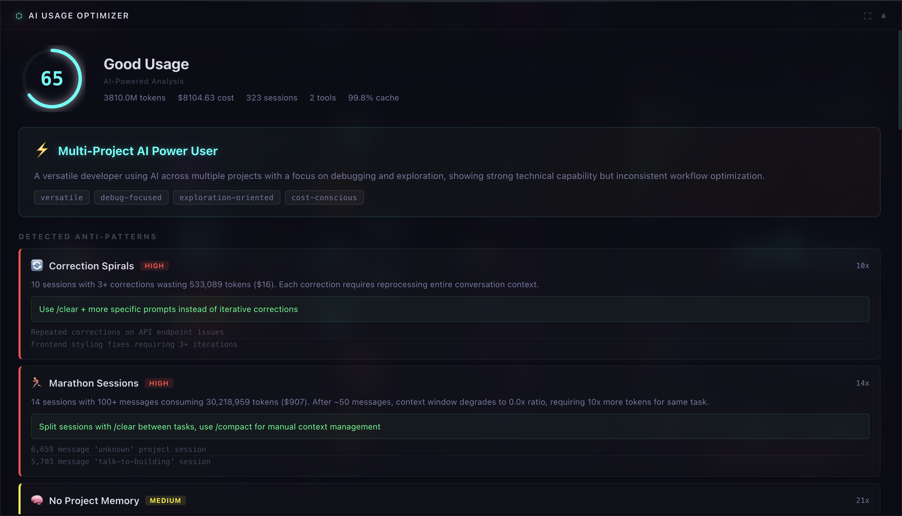

# agenttop

`htop` for AI coding agents.

```bash
git clone https://github.com/vicarious11/agenttop && cd agenttop && ./setup.sh
./run.sh    # localhost:8420
```



Monitors **Claude Code**, **Cursor**, **Kiro**, **Codex**, **Copilot**. Reads the local files they already write (`~/.claude/`, `~/.cursor/`, etc). Read-only. Nothing leaves your machine.

## what it does

- unified dashboard across all your AI coding tools
- every session, every prompt, every token, every dollar — one place
- search sessions by project, sort by cost, view full prompt history
- AI analysis: scores you 0-100 on session hygiene, prompt quality, cost efficiency, cache usage, tool utilization
- cost forensics: spend by project, by model, estimated waste from marathon sessions
- detects anti-patterns: correction spirals, context blowup, repeated prompts, model overkill

## install

```bash
git clone https://github.com/vicarious11/agenttop && cd agenttop && ./setup.sh
```

or `pip install agenttop`

## run

```bash
./run.sh              # web dashboard
.venv/bin/agenttop    # terminal dashboard
agenttop init         # set up LLM for analysis (ollama/anthropic/openai)
```

## data sources

```
~/.claude/projects/**/*.jsonl        exact token counts per message
~/.cursor/ai-tracking/*.db           conversations, models, AI vs human ratio
~/.codex/.codex-global-state.json    prompts, automations
~/.config/github-copilot/            session state
~/Library/.../Kiro/state.vscdb       workspace data
```

## architecture

```
                    ┌──────────────────────────────────────────────┐
                    │             YOUR MACHINE (read-only)         │
                    │                                              │
                    │  ~/.claude/   ~/.cursor/   ~/.codex/   ...   │
                    └──────┬───────────┬────────────┬──────────────┘
                           │           │            │
                           ▼           ▼            ▼
                    ┌──────────────────────────────────────────────┐
                    │              COLLECTORS                       │
                    │                                              │
                    │  ClaudeCodeCollector    → JSONL parser        │
                    │  CursorCollector        → SQLite + workspace  │
                    │  KiroCollector          → VS Code state DB    │
                    │  CodexCollector         → JSON + SQLite       │
                    │  CopilotCollector       → session JSON        │
                    │                                              │
                    │  Each: collect_sessions() → list[Session]     │
                    │        get_stats(days)    → ToolStats         │
                    └──────────────────┬───────────────────────────┘
                                       │
                          ┌────────────┴────────────┐
                          ▼                         ▼
                   ┌─────────────┐          ┌─────────────┐
                   │  WEB (D3)   │          │  TUI (term)  │
                   │  port 8420  │          │  textual     │
                   │             │          │              │
                   │  FastAPI    │          │  5 tabs:     │
                   │  WebSocket  │          │  dashboard   │
                   │  3 tabs:    │          │  sessions    │
                   │  overview   │          │  explorer    │
                   │  sessions   │          │  analysis    │
                   │  analyze    │          │  graph       │
                   └──────┬──────┘          └──────────────┘
                          │
                          ▼
                   ┌──────────────────────────────────────┐
                   │      OPTIMIZER (map-reduce-generate)  │
                   │                                      │
                   │  MAP:     per-session LLM calls      │
                   │           (cached, concurrent)        │
                   │           intent, spirals, quality    │
                   │                                      │
                   │  REDUCE:  pure python, deterministic  │
                   │           score 0-100, 5 dimensions   │
                   │           cost forensics, anti-pats   │
                   │                                      │
                   │  GENERATE: single LLM call            │
                   │           profile, recs, insights     │
                   │                                      │
                   │  LLM: ollama / anthropic / openai     │
                   └──────────────────────────────────────┘
```

**collectors** parse tool-specific local files into a unified `Session` model (id, tool, project, messages, tokens, cost, prompts, timestamps). each collector handles one tool's quirks — JSONL for Claude, SQLite for Cursor, JSON blobs for Codex.

**web dashboard** is vanilla JS + D3, no frameworks. FastAPI serves the API and static files. WebSocket for live updates. three tabs: overview (knowledge graph + panels), sessions (paginated browser with detail pane), analyze (select sessions → LLM analysis → score + cost forensics + recommendations).

**TUI** is built on textual. plotext for charts. five tabs: dashboard (stats + charts), sessions (project aggregates + history), explorer (interactive search/select/analyze), analysis (model usage + intent distribution), graph (tree view).

**optimizer** is the interesting part. three phases:

1. **MAP** — takes your top 30 sessions (by cost), sends each to an LLM with full prompt history. classifies: intent (debugging/greenfield/exploration/...), had correction spirals?, prompt quality, wasted effort. results cached per session ID at `~/.agenttop/session_cache.json` — sessions are immutable so they're never re-analyzed. max 10 new sessions per run. concurrent: 1 worker for ollama, 4 for cloud.

2. **REDUCE** — pure python. no LLM. computes a deterministic score from 5 dimensions (0-20 points each):
   - session hygiene: `sessions_without_spirals / total × 20`
   - prompt quality: `sessions_without_waste / total × 20`
   - cost efficiency: `(1 - waste_pct/100) × 20`
   - cache efficiency: `cache_hit_rate/100 × 20`
   - tool utilization: `features_used/features_available × 20`

   also computes cost forensics (spend by project, by model, waste estimation from marathon sessions) and anti-pattern counts.

3. **GENERATE** — single LLM call with ~2K tokens of pre-computed metrics. LLM writes prose (developer profile, recommendations, project insights). it does NOT compute any numbers — those come from REDUCE.

the score is fully traceable. "session hygiene: 14/20 — 23/30 sessions had no correction spirals." not a vibe check.

## API

| endpoint | what |
|----------|------|
| `GET /api/stats?days=N` | aggregated stats from all collectors |
| `GET /api/sessions?days=N` | all sessions (paginated client-side) |
| `GET /api/sessions/{id}` | full session detail with prompts |
| `GET /api/models` | claude model usage (input/output/cache) |
| `GET /api/hours` | hourly token distribution |
| `GET /api/graph` | D3-compatible knowledge graph |
| `POST /api/analyze-sessions` | LLM analysis on selected sessions |
| `POST /api/optimize` | full optimizer pipeline |
| `GET /api/optimize-stream` | SSE streaming progress + result |
| `WS /ws` | real-time stat updates |

## config

zero config by default. `agenttop init` for interactive setup, or:

```toml
# ~/.agenttop/config.toml
[llm]
provider = "ollama"           # ollama | anthropic | openai | openrouter
model = "ollama/gemma3:4b"
map_concurrency = 0           # 0 = auto
```

## no telemetry

zero. local only. ollama = nothing leaves your machine.

## license

Apache 2.0
